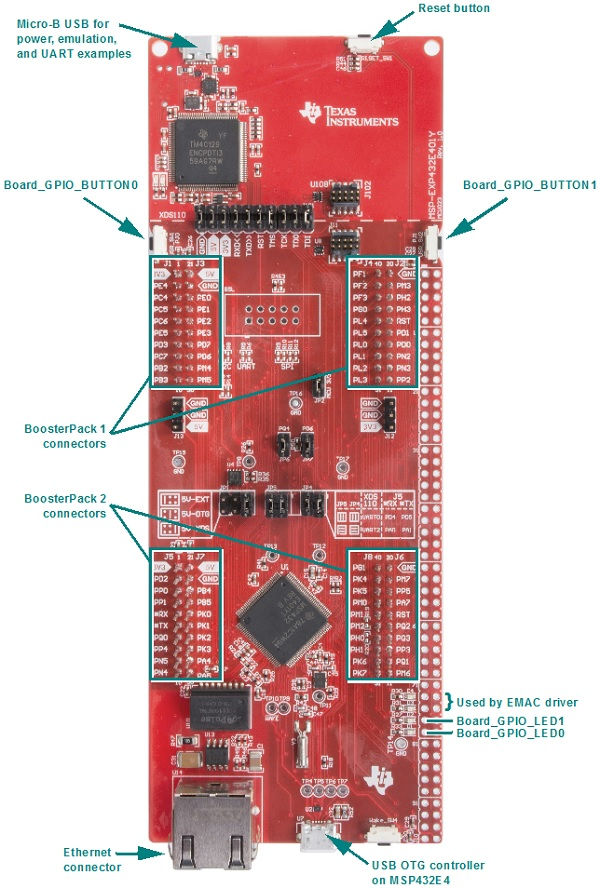

# MSP-EXP432E401Y Settings and Resources

The MSP-EXP432E401Y board contains an MSP432E401Y device.

## Jumper Settings

* Set JP1 to the 5V-XDS position.
* Set JP2. (These settings for JP1 and JP2 provide power to the MSP432E401Y device.)
* Set JP4 and JP5 to the UART0 position as indicated on the board's silkscreen. This provides UART communications via the onboard USB debugger.
* Set JP4 and JP5 to the UART2 position as indicated on the board's silkscreen if using CAN. This redirects UART communications via the onboard USB debugger through UART2 instead.
* If you use a BoosterPack with this board, the BoosterPack fits over J1 and J2.

## Board resources used in driver examples

The following table lists the Board names of the resources used by
the driver examples, and their corresponding pins.  Note that there may be
other resources configured in the board files that are not used by any
driver example.  Only the example resources are listed in the table.

  |Board Resource|Pin|
  |--------------|:---|
  |`Board_ADC0`|PE3|
  |`Board_ADC1`|PE2|
  |`Board_ADCBUF0CHANNEL0`|PE3|
  |`Board_CAN0`|\*RX - `CANRX`, \*TX - `CANTX`|
  |`Board_GPIO_LED0`|PN1|
  |`Board_GPIO_LED1`|PN0|
  |`Board_GPIO_BUTTON0`|PJ0|
  |`Board_GPIO_BUTTON1`|PJ1|
  |`Board_I2C0`|PN4 - `SDA`, PN5 - `SCL`|
  |`Board_I2C_TMP`|PN4 - `SDA`, PN5 - `SCL`|
  |`Board_PWM0`|PF0|
  |`Board_SD0`|PD3 - `CLK`, PD1 - `XDAT0\MOSI`, PD0 - `XDAT1\MISO`, PD2 - `FSS`, PC7 - `CS` (XDAT0 serves as TX and XDAT1 serves as RX)|
  |`Board_SDFatFS0`|PD3 - `CLK`, PD1 - `XDAT0\MOSI`, PD0 - `XDAT1\MISO`, PD2 - `FSS`, PC7 - `CS` (XDAT0 serves as TX and XDAT1 serves as RX)|
  |`Board_SPI0`|PD3 - `CLK`, PD1 - `XDAT0`, PD0 - `XDAT1`, PD2 - `FSS\CS` (XDAT0 serves as TX and XDAT1 serves as RX)|
  |`Board_SPI1`|PQ0 - `CLK`, PQ2 - `XDAT0`, PQ3 - `XDAT1`, PQ1 - `FSS\CS` (XDAT0 serves as TX and XDAT1 serves as RX)|
  |`Board_SPI_MASTER`|PD3 - `CLK`, PD1 - `XDAT0\MOSI`, PD0 - `XDAT1\MISO`, PD2 - `FSS\CS` (XDAT0 serves as TX and XDAT1 serves as RX)|
  |`Board_SPI_SLAVE`|PD3 - `CLK`, PD1 - `XDAT0\MISO`, PD0 - `XDAT1\MOSI`, PD2 - `FSS\CS` (XDAT1 serves as TX and XDAT0 serves as RX)|
  |`Board_SPI_MASTER_READY`|PM3|
  |`Board_SPI_SLAVE_READY`|PL0|
  |`Board_UART0`|PA0 - `RX`, PA1 - `TX`  (UART provided through emulation, JP4 and JP5 jumpers must be set to UART0 position)|

## BoosterPacks

The following examples require BoosterPacks.

  |Example|BoosterPack|
  |-------|:------------|
  |display|[BOOSTXL-SHARP128 LCD & SDCard BoosterPack](http://www.ti.com/tool/boostxl-sharp128)|
  |fatsd|[BOOSTXL-SHARP128 LCD & SDCard BoosterPack](http://www.ti.com/tool/boostxl-sharp128)|
  |fatsdraw|[BOOSTXL-SHARP128 LCD & SDCard BoosterPack](http://www.ti.com/tool/boostxl-sharp128)|
  |i2ctmp116|[BP-BASSENSORSMKII BoosterPack](http://www.ti.com/tool/BP-BASSENSORSMKII)|
  |i2copt3001\_cpp|[BP-BASSENSORSMKII BoosterPack](http://www.ti.com/tool/BP-BASSENSORSMKII)|
  |portable|[BP-BASSENSORSMKII BoosterPack](http://www.ti.com/tool/BP-BASSENSORSMKII)|
  |sdraw|[BOOSTXL-SHARP128 LCD & SDCard BoosterPack](http://www.ti.com/tool/boostxl-sharp128)|

### BOOSTXL-SHARP128 LCD & SDCard BoosterPack Modifications

>For examples using the BOOSTXL-SHARP128 LCD & SDCard BoosterPack,
the BoosterPack should be placed on the __BoosterPack 1 connectors__ of the
LaunchPad.

### BP-BASSENSORSMKII BoosterPack Modifications

>For the __i2ctmp116__ and __portable__ examples, BP-BASSENSORSMKII BoosterPack
should be placed on the __BoosterPack 2 connectors__ of the LaunchPad.

## Peripherals Used

The following list shows which MSP_EXP432E401Y peripherals are used by
driver and kernel applications. Driver examples control which peripherals (and which ports) are used.

* __TI-RTOS Kernel (SYS/BIOS).__ Uses the first general-purpose timer available and that timer's associated interrupts. Generally, this will be Timer0. The TI-RTOS Kernel manages the interrupt controller statically without an interrupt dispatcher.
* __Drivers.__
    * __CAN__: The CAN driver is configured to use CAN0. A separate CAN transceiver is needed to go from *RX and *TX to CANH and CANL on a CAN bus. The JP4 and JP5 change is also needed as mentioned in the Jumper Settings section above.
    * __I2C:__ The I2C driver is configured on I2C0 and I2C7 to support various BoosterPacks.
    * __NVS:__ The `Board_NVSINTERNAL` region uses on-chip flash memory. This NVS region is defined in the example application's board file.
    * __PWM:__ The PWM driver uses an onboard LED (PF0). These pins are configured for the PWM driver. While these pins can also be used by the GPIO driver, your application's board file must ensure that the pins are not simultaneously used by the GPIO and PWM drivers.
    * __SD:__ The SD driver is built on the GPIO and SPI drivers to communicate with an SD card via SPI.  `Board_SD0` uses `Board_SPI0` to send data to-and-from the SD card.
    * __SDFatFS:__ The SDFatFS driver relies on an SD driver instance to communicate with an SD card; `Board_SDFatFS0` uses the `Board_SD0` driver instance.
    * __SPI:__ The SPI driver is configured to use SSI2 and SSI3 for SPI communications. Note that the SPI pins are distinguished by their role (TX/RX) instead of MOSI/MISO. This means that the data pins will act as MOSI or MISO depending on whether the device is a SPI master or slave. In master mode, `XDAT0` pins are `MOSI` and `XDAT1` pins are `MISO`. The converse is true when the device is in slave mode.
    * __Timer:__ The Timer, PWM and Capture driver use the timer peripheral.
    * __UART:__ The UART driver uses UART0, which is attached to the onboard emulator to facilitate serial communications.
    * __Watchdog:__ The Watchdog driver example uses the Watchdog Timer peripheral.
